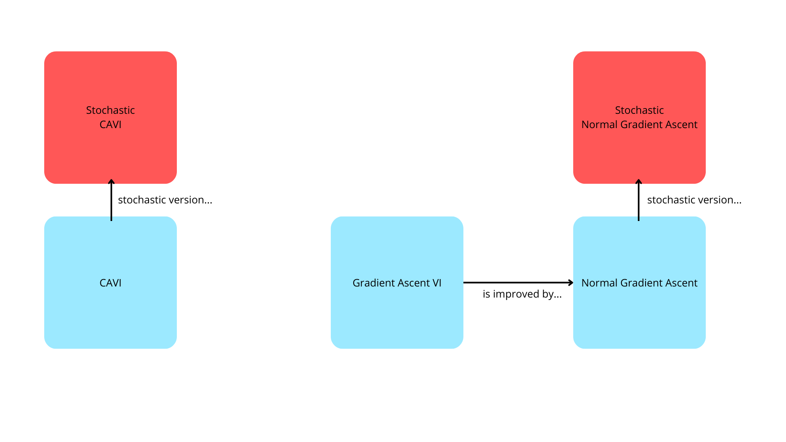

# Variationnal Auto Encoder (VAE)
In recent articles about image generation, the state-of-art seems to be accomplished by a model named *Variationnal Auto Encoder*.
To understand this model we need to go further in two keys concept : *Variationnal Inference* (VI) and *Auto Encoder* (AE).

## Varitional Inference (VI)
Variationnal Inference is a branch of statistic which try to approach an unkonwn distribution from known distributions $\{q_{\theta}\}$. A way to approach the unknown distribution is for example by adjusting parameters of the knowned distrbution.

For example if you want to approximate a given distribution by using a Gaussian family. You have to set correctly $\mu$ and $\sigma$ until your gaussian distribution $q_{\mu,\sigma}$ is *similar* to the target distibution.

To start a *Variational Inference* it is necessary to get : 
1. A familly of parameterized known distributions $\{q_{\theta}\}$.
2. A metric to compare how far we are of the unkown distibution.

To explore these notions further, you can read [VI : a review for statisticians](https://arxiv.org/pdf/1601.00670).

### General formulation of VI problem and ELBO
A natural metric to compare the divergence between two distibution $p$ and $q$ is the **Kullback-Leiber divergence** KL : 
$\textbf{KL(p||q)}=\int_Z q(z).\log{\frac{p(z)}{q(z)}}$ where Z is the definition set of p and q.

In pratice, we want to estimate a posterior distribution in order to solve machine learning problem.
Let $p(z|x)$ a posterior distribution and $p(x|z)$ the associates likelihood.

In order to estimate a posterior, we have data $x$. We set a statistic model and then get a model likelihood.

As a result, a *Varitional Inference* (VI) problem with KL-divergence as a metric is formulated as :
$$ \argmin_{q\in Q} \textbf{KL}(q||p(z|x))$$
With expectation manipulations and Bayes rule the $\textbf{KL}$ become :

$\textbf{KL}(q||p(z|x))=-$$(E[\log{q(z)}]-E[\log{p(x|z)}.p(z)])$+$\log{p(x)}$

Maximise the red box is equivalent to minimize the $\textbf{KL}$.
This quantity, in the red box, is the **ELBO** (Evidence Lower Bound).

In order to find the closest distribution $q$ of $p(z|x)$ we have to maximize the ELBO $(E[\log{q(z)}]-E[\log{p(x|z)}.p(z)])$

### How to maximize ELBO ? What are known quatities ?
We begin a VI problem with knwown data $x$. From this data, we build a statistic model with a prior distribution and a parametrized likelihood.
Then we set a form for $q$ like for example a Gaussian or another Exponential distribution.

We remember that we are looking for the posterior distribution. Since the distribution $p(x)$ is difficult to compute, we try to get the posterior by approaching it.

### CAVI : Coordinate Ascent VI
The basic algorithm to maximize ELBO and find the approximate distribution $q$ is *Coordinate Ascent VI* (CAVI) algorithm.

In order to compute at d-dimensions case, CAVI make an assumption on distribution. 
We suppose that each dimension are independent i.e : $q=\Pi_{i=1}^d q_j(z_j)$

The CAVI algorithm suggests to calculate the optimal distribution of direction $j$ only by fixing other variables along their direction.

It is possible to demonstrate that, under the **KL** as metric, the optimal distribution $q_{\theta}(z_j)$ (distribution which maximize ELBO) in for direction $j$ is proportionnal to $\exp(E_{-j}[p(z,x)])$. 
For mathematic details you can check the *Meerkat Statistic*'s course about VI.

Here is the algorithm :

Init : Set parameters randomly.
1. Calculate all optimal distributions $q(z_j)$. Note that the form of $q(z_j)$ depends of the form $q(z_i)$.
2. Compute the ELBO.

Then loop these steps until $|ELBO_t - ELBO_{t-1}| \lt \epsilon$.

### Gradient Ascent VI and Normal Gradient
Note that, since the aim is to find the best $\theta$ by maximizing ELBO, it is sometimes possible to compute the gradient of the ELBO and to proceed at the optimization of $\theta$ similarly to a gradient descent. 

$$\theta^{t} = \theta^{t-1}+\alpha^t.\nabla\textbf{ELBO} $$

This method is called **Gradient Ascent VI**.

<u> *But is the gradient really a good metric to compare distributions ?*</u>
The gradient (and derivative in general) are defined naturally from an euclidiean distance. 
Here it is an euclidiean distance in the space of the parameters.

Let's look at an example.

Visually the first two distributions are similar, while the two others are barely overlapping.
However the canonic euclidean distance with the respect of $\mu$ says the inverse.

**The Euclidean gradient is sometimes not well adapted to VI.**

<u> The solution : Natural Gradient, a Riemanian gradient </u>
The solution, as explained in this [paper](https://arxiv.org/html/2406.01870v1), is to define a gradient in a Riemanian space with a symetric version of the **KL**.
This solution is also discussed in the [Stochastic VI paper](https://arxiv.org/pdf/1206.7051).

This gradient is named the *Natural Gradient* : $\nabla^{\text{natural}}=\mathcal{I}^{-1}[q].\nabla$.
It is the product of the inverse of the Fischer matrix and the original gradient.

As a result, we define the *Normal Gradient Ascent VI*, which uses the normal gradient in its formula.

Like for the *Gradient Ascent VI*, the *Normal Gradient* is simple to compute with an Exponential family.

Here a resume of VI method to get posterior distribution from the ELBO :

### Limitations of VI algorithm and Stochastic VI
The main issue with classic VI is that for each substep and iteration, we need to go through the entire dataset.

A natural improvement would be to use mini-batches, thus introducing stochastic behavior.

As a result, we adapt *Coordinate Ascent VI* (CAVI) into *Gradient Ascent VI* in its stochastic version, meaning the same algorithms, but using mini-batches instead of the full dataset.
*If you are not familiar with mini-batches methods you can check this [link](https://towardsdatascience.com/batch-mini-batch-stochastic-gradient-descent-7a62ecba642a).*

This opens the door to *Stochastic Variational Inference*, with more scalable and better suited to large dataset algorithms.

## Auto-Encoder

## Variationnal Auto-Encoder (VAE)

### Application in image generation
### Nouveau Variationnal Auto-Encoder (NVAE)